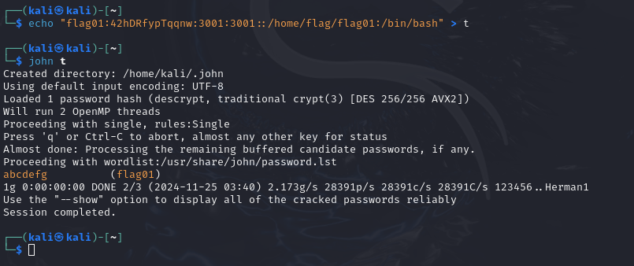

```bash
cat /etc/passwd
```

Password hash for *flag01*

`flag01:42hDRfypTqqnw:3001:3001::/home/flag/flag01:/bin/bash`

Copy hash in kali and crack it with JohnTheRipper

`echo "flag01:42hDRfypTqqnw:3001:3001::/home/flag/flag01:/bin/bash" > t`



```bash
su flag01 / abcdefg
```
